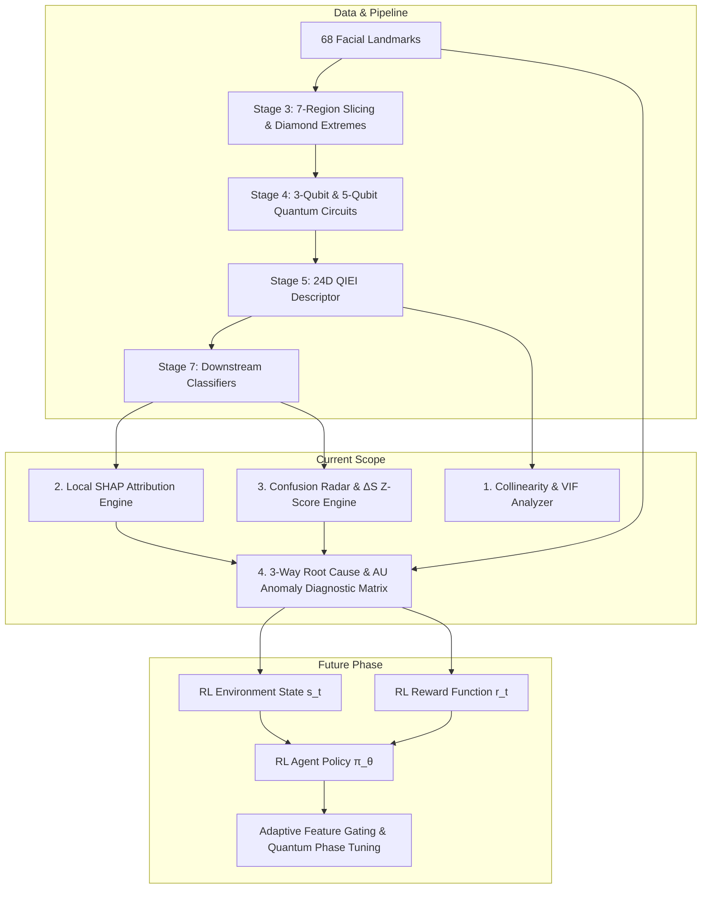

# Localized Observation Layer & RL Roadmap for QIEI-Based Facial Expression Analysis
**Creation Timestamp:** 2026-09-30T23:35:24+05:30  
**Repository Path:** `docs/research/localized_explainability_plan.md`

---

## 1. Scope & Core Objectives

### Phase 1 Focus: Pure Observation & Diagnostic Layer (Active Now)
The immediate goal is **Observation Only** — creating a diagnostic observatory for QIEI descriptors that extracts granular per-instance signals without mutating model parameters or running automated repair loops yet:
1. **Per-Sample Feature Attribution**: What exact QIEI intra/inter features drove prediction $f(\mathbf{x}_i)$?
2. **Confusion-Conditioned Differential Entanglement**: How do QIEI entanglement profiles shift during misclassifications (e.g., $\text{Fear} \to \text{Surprise}$)?
3. **Landmark-Quality & AU Anomaly Diagnostics**: Is an error caused by input landmark degradation ($C_{\text{lm}}$), quantum feature miscalibration ($\Delta S$), or classifier boundary overlap?

### Phase 2 Roadmap: Reinforcement Learning Optimization (Future Phase)
The observations collected in Phase 1 serve as the **Environment State Representation** ($s_t$) and **Reward Signals** ($r_t$) for a future Reinforcement Learning (RL) agent:
- **RL State Space**: Landmark confidence scores + 24D QIEI descriptors + differential entanglement $Z$-scores.
- **RL Action Space**: Adaptive feature gating weights $w_j \in [0, 1]$, quantum circuit phase rotation offsets $\Delta \theta_k$, or region-pair attention weights.
- **RL Reward Function**: Maximizing classification accuracy while minimizing AU anatomical anomaly index $A_{\text{AU}}$ and entanglement miscalibration $|Z_j|$.

---

## 2. Observation Layer Architecture & Workflow



---

## 3. Detailed Technical Specifications (Observation Layer)

### 3.1 Collinearity & Variance Inflation Factor (VIF) Analyzer
- **File**: `implementation/xai_collinearity_analyzer.py`
- **Function**: Calculates Pearson/Spearman correlation matrix and VIF scores across all 24 QIEI features:
  $$\text{VIF}_j = \frac{1}{1 - R_j^2}$$
- **Output**: Detects collinear symmetric pairs (e.g. `inter_right_eyebrow__nose` vs. `inter_left_eyebrow__nose`) and recommends feature grouping for attribution.

### 3.2 Per-Sample SHAP Attribution Engine
- **File**: `implementation/xai_shap_attribution.py`
- **Function**: Applies KernelSHAP / TreeSHAP to decompose sample predictions into exact local feature attributions:
  $$f(\mathbf{x}_i) = \phi_0 + \sum_{j=1}^{24} \phi_j(\mathbf{x}_i)$$
- **Output**: Generates per-instance waterfall plots and top-3 positive/negative driver summaries.

### 3.3 Confusion Radar & Differential Entanglement ($\Delta S$) Engine
- **File**: `implementation/xai_confusion_radar.py`
- **Function**: Filters samples by true vs. predicted emotion pairs $(y_{\text{true}}, \hat{y})$ and computes:
  $$\Delta S_j = \bar{x}_{j, \text{error}} - \bar{x}_{j, \text{correct}}$$
  $$Z_j = \frac{\bar{x}_{j, \text{error}} - \bar{x}_{j, \text{correct}}}{\sqrt{\frac{s_{\text{correct}}^2}{N_{\text{correct}}} + \frac{s_{\text{error}}^2}{N_{\text{error}}}}}$$
- **Output**: 7-axis intra and 21-axis inter radar plots highlighting statistically miscalibrated axes ($|Z_j| > 1.96$).

### 3.4 Root Cause & AU Anomaly Diagnostic Matrix
- **File**: `implementation/xai_root_cause_diagnostics.py`
- **Function**: Categorizes every prediction failure into one of 3 explicit categories:
  1. **Landmark Data Degradation**: Landmark confidence $C_{\text{lm}} < \tau_{\text{conf}}$.
  2. **Quantum Feature Miscalibration**: $C_{\text{lm}} \ge \tau_{\text{conf}}$ and top SHAP feature $|Z_j| > 1.96$.
  3. **Classifier Boundary Overlap**: Normal features/confidence near boundary.
- **AU Anomaly Index**: Computes anatomical consistency flag $A_{\text{AU}}(\mathbf{x}_i) \in [0, 1]$ using FACS mappings.

### 3.5 Master Observation Orchestrator
- **File**: `implementation/run_xai_observation_pipeline.py`
- **Function**: Runs all observation modules sequentially on dataset benchmarks (CK+, AffectNet, SAMM) and outputs consolidated diagnostic artifacts to `artifacts/xai/`.

---

## 4. Future Reinforcement Learning (RL) Roadmap

```
┌───────────────────────────────────────────────────────────────────────────────────┐
│                      FUTURE RL OPTIMIZATION SPECIFICATION                         │
├──────────────────┬────────────────────────────────────────────────────────────────┤
│ RL Element       │ Design Specification                                           │
├──────────────────┼────────────────────────────────────────────────────────────────┤
│ State (s_t)      │ [24D QIEI vector, Landmark Confidence C_lm, Top Z-scores,      │
│                  │  FACS AU Anomaly Score A_AU]                                   │
├──────────────────┼────────────────────────────────────────────────────────────────┤
│ Action (a_t)     │ 24D continuous feature-gating vector w_t ∈ [0, 1]^24 or        │
│                  │ quantum phase adjustment offsets Δθ_k                           │
├──────────────────┼────────────────────────────────────────────────────────────────┤
│ Reward (r_t)     │ r_t = +1.0 (if correct) - 1.0 (if incorrect) - λ * A_AU        │
├──────────────────┼────────────────────────────────────────────────────────────────┤
│ Policy (π_θ)     │ Proximal Policy Optimization (PPO) or Soft Actor-Critic (SAC)  │
└──────────────────┴────────────────────────────────────────────────────────────────┘
```

---

## 5. Verification & Test Checkpoints (Observation Scope)

1. **Collinearity Test**: Verify VIF calculation and grouping for symmetric eyebrow/eye pairs.
2. **Local SHAP Efficiency**: Confirm $\sum \phi_j = f(\mathbf{x}_i) - \phi_0$ within $10^{-5}$ tolerance.
3. **Radar Plot Polygon Integrity**: Verify 7-axis intra and 21-axis inter radar plots render clearly for all confusion pairs.
4. **Taxonomy Partition Integrity**: Verify $N_{\text{degradation}} + N_{\text{miscalibration}} + N_{\text{boundary}} = N_{\text{total\_errors}}$ exactly.
5. **State/Reward Log Export**: Confirm all diagnostic outputs export cleanly into structured JSON format for downstream RL training.
