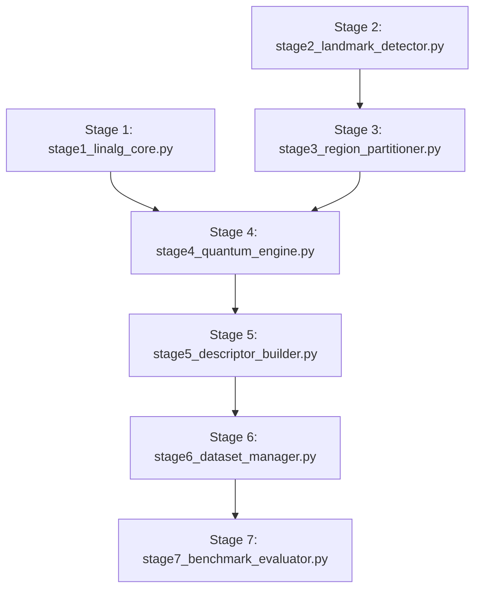
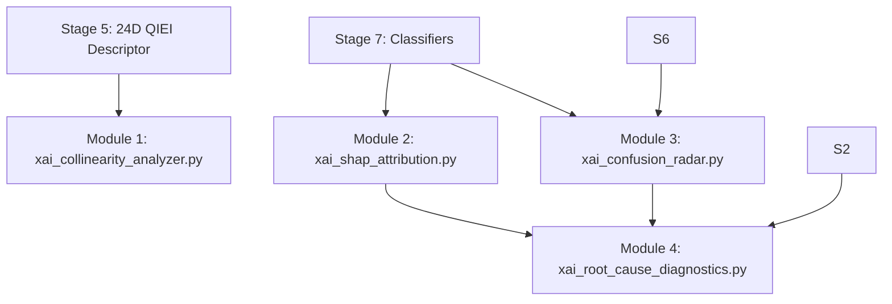

# Master Technical Notes & Prerequisites: QIEI Localized Explainability & RL Optimization Layer
**Creation Timestamp:** 2026-10-01T01:53:57+05:30  
**Repository Document:** `docs/research/qiei_detailed_technical_notes.md`  
**Master Execution Log:** [`implementation/artifacts/xai/rl_optimization_report.json`](file:///c:/Users/likhi/OneDrive/Pictures/Desktop/addn/kingmenss/implementation/artifacts/xai/rl_optimization_report.json)

---

## 1. Prerequisites & Foundational Mathematical Principles

### 1.1 Quantum Mechanics & Hilbert-Space Mathematics
The Quantum Information Entanglement Index (QIEI) evaluates facial landmark geometry within complex Hilbert spaces $\mathcal{H} = \mathbb{C}^{2^n}$:

1. **Dirac Bra-Ket Notation & State Vectors**:
   - A single-qubit state $|\psi\rangle \in \mathbb{C}^2$ is expressed as $|\psi\rangle = \alpha |0\rangle + \beta |1\rangle$, where $\alpha, \beta \in \mathbb{C}$ and $|\alpha|^2 + |\beta|^2 = 1$.
   - For an $n$-qubit system, state space is spanned by $2^n$ basis vectors: $\{|00\dots0\rangle, |00\dots1\rangle, \dots, |11\dots1\rangle\}$.

2. **Kronecker / Tensor Product ($\otimes$)**:
   - Multi-qubit superposition state initialization $|+\rangle^{\otimes n}$:
     $$|+\rangle = \frac{1}{\sqrt{2}} \begin{pmatrix} 1 \\ 1 \end{pmatrix} \implies |+\rangle^{\otimes n} = \frac{1}{\sqrt{2^n}} \begin{pmatrix} 1 \\ 1 \\ \dots \\ 1 \end{pmatrix} \in \mathbb{C}^{2^n}$$

3. **Density Matrices ($\rho$) & Partial Trace ($\text{Tr}_B$)**:
   - A pure quantum state $|\psi\rangle$ has density matrix $\rho = |\psi\rangle\langle\psi| \in \mathbb{C}^{2^n \times 2^n}$.
   - To compute localized regional entropy, subsystem $B$ is traced out via partial trace:
     $$\rho_A = \text{Tr}_B(\rho) = \sum_{k} (I_A \otimes \langle k|_B) \rho (I_A \otimes |k\rangle_B)$$

4. **Von Neumann Entropy ($S$)**:
   - Quantifies bipartite quantum entanglement for reduced density matrix $\rho_A$:
     $$S(\rho_A) = -\text{Tr}(\rho_A \log_2 \rho_A) = -\sum_{i=1}^{\text{rank}(\rho_A)} \lambda_i \log_2 \lambda_i$$
     where $\lambda_i$ are the non-zero eigenvalues of $\rho_A$.
   - **Theoretical Bounds**:
     - 1-qubit subsystem $A$ (Intra-region): $S(\rho_A) \in [0.0, 1.0]$ bits.
     - 3-qubit subsystem $R_1$ (Inter-region): $S(\rho_{R_1}) \in [0.0, 3.0]$ bits ($\log_2 2^3 = 3$).

---

### 1.2 Quantum Gate Formulation
1. **Hadamard Gate ($H$)**: Creates equal superposition state $|+\rangle = H|0\rangle$:
   $$H = \frac{1}{\sqrt{2}} \begin{pmatrix} 1 & 1 \\ 1 & -1 \end{pmatrix}$$
2. **Single-Qubit Phase Rotation Gate ($R_z$)**: Encodes normalized coordinate angles $\theta_k$:
   $$R_z(2\theta_k) = \begin{pmatrix} e^{-i\theta_k} & 0 \\ 0 & e^{i\theta_k} \end{pmatrix}$$
3. **Controlled-Z Gate ($CZ$)**: Entangles pair qubits $(i, j)$:
   $$CZ = \text{diag}(1, 1, 1, -1)$$
4. **Ising Entangling Gate ($R_{ZZ}$)**:
   $$R_{ZZ}(\theta_{ij}) = \exp\left(-i \frac{\theta_{ij}}{2} Z \otimes Z\right) = \text{diag}\left(e^{-i\frac{\theta_{ij}}{2}}, e^{i\frac{\theta_{ij}}{2}}, e^{i\frac{\theta_{ij}}{2}}, e^{-i\frac{\theta_{ij}}{2}}\right)$$

---

### 1.3 Facial Action Coding System (FACS) Prerequisites
FACS taxonomy decomposes facial expressions into anatomical muscle contractions called **Action Units (AUs)**:

| Action Unit (AU) | Anatomical Name | Primary Facial Region | Associated Emotion |
| :--- | :--- | :--- | :--- |
| **AU1** | Inner Brow Raiser | Eyebrows | Surprise, Fear, Sadness |
| **AU2** | Outer Brow Raiser | Eyebrows | Surprise, Fear |
| **AU4** | Brow Lowerer | Eyebrows / Nose Bridge | Anger, Fear, Sadness |
| **AU6** | Cheek Raiser | Eyes / Upper Cheek | Happiness, Disgust |
| **AU9** | Nose Wrinkler | Nose | Disgust |
| **AU12** | Lip Corner Puller | Mouth Outer Corners | Happiness, Contempt |
| **AU14** | Dimpler | Mouth Corners | Contempt |
| **AU20** | Lip Stretcher | Mouth Outer / Jaw | Fear |
| **AU25** | Lips Part | Inner / Outer Mouth | Surprise, Anger, Happiness |
| **AU26** | Jaw Drop | Jaw / Mouth | Surprise |

---

### 1.4 Explainable AI (XAI) & Game Theory Prerequisites
1. **Shapley Value Axioms**:
   - **Efficiency**: $\sum_{j=1}^D \phi_j(\mathbf{x}_i) = f(\mathbf{x}_i) - E[f(x)]$.
   - **Symmetry**: If feature $j$ and $k$ contribute identically across all coalitions $S$, $\phi_j = \phi_k$.
   - **Dummy**: If feature $j$ adds zero marginal value to every coalition $S$, $\phi_j = 0$.
   - **Additivity**: For combined models $f + g$, $\phi_j(f+g) = \phi_j(f) + \phi_j(g)$.

2. **Variance Inflation Factor ($\text{VIF}$)**:
   - Evaluates multicollinearity of feature $x_j$ regressed against all other $D-1$ features:
     $$\text{VIF}_j = \frac{1}{1 - R_j^2}$$
   - Threshold $\text{VIF}_j > 5.0$ indicates strong collinearity requiring **Grouped KernelSHAP**.

3. **Grouped KernelSHAP**:
   - Combines collinear symmetric feature pairs into meta-groups $\mathcal{G} = \{G_1, \dots, G_M\}$:
     $$\phi_{G_m} = \sum_{S \subseteq \mathcal{G} \setminus \{G_m\}} \frac{|S|!(|\mathcal{G}| - |S| - 1)!}{|\mathcal{G}|!} \left[ f_x(S \cup \{G_m\}) - f_x(S) \right]$$

---

### 1.5 Reinforcement Learning (RL) Prerequisites
1. **Markov Decision Process (MDP) Tuple $(S, A, P, R, \gamma)$**:
   - **State Space ($S \in \mathbb{R}^{27}$)**: $[24\text{D QIEI}, C_{\text{lm}}, A_{\text{AU}}, |Z_{\text{max}}|]$.
   - **Action Space ($A \in \mathbb{R}^{24}$)**: Continuous dampening logits $a_t \in \mathbb{R}^{24}$.
   - **Reward Signal ($R_t$)**: $R_t = +1.5 - 0.4 A_{\text{AU}}$ (if correct), $-1.0 - 0.5 A_{\text{AU}}$ (if incorrect).

2. **Targeted Soft-Gating Formulation**:
   $$w_j = 1.0 - g_j \cdot (0.4 \cdot \sigma(a_j)) \implies w_j \in [0.6, 1.0]$$
   where $g_j \in \{0, 1\}$ is the miscalibration mask from Module 3 ($g_j = 1$ if $|Z_j| > 1.96$).

3. **Policy Gradient REINFORCE Update**:
   $$\nabla_\theta J(\theta) = \mathbb{E}_{\pi_\theta} \left[ \nabla_\theta \log \pi_\theta(a_t \mid s_t) R_t \right]$$

---

## 2. Base Pipeline Architectural Specification (Stages 1–7)



### Stage 1: Linear Algebra Core (`stage1_linalg_core.py`)
- **Functions**: `initialize_hadamard_state(n)`, `apply_phase_rotations(state, n, angles)`, `apply_pairwise_entanglement(state, n, angles)`, `compute_reduced_density_matrix(state, n, trace_out_qubits)`, `compute_von_neumann_entropy(rho)`.
- **Purpose**: Exact NumPy quantum statevector simulator for superposition, phase rotation, CZ/RZZ entangling, partial trace, and von Neumann entropy.

### Stage 2: Landmark Detector (`stage2_landmark_detector.py`)
- **Functions**: `detect_landmarks(image_path)`, `generate_anatomical_synthetic_landmarks(w, h)`.
- **Purpose**: Extracts 68 2D landmark coordinates $(x, y)$ using OpenCV / Mediapipe / dlib and computes landmark detection confidence $C_{\text{lm}} \in [0, 1]$.

### Stage 3: Anatomical Region Partitioner (`stage3_region_partitioner.py`)
- **Functions**: `extract_region_extreme_points(points)`, `partition_and_extract_all_regions(landmarks_68)`.
- **Purpose**: Partitions 68 landmarks into 7 anatomical regions ($\text{jaw}$, $\text{right\_eyebrow}$, $\text{left\_eyebrow}$, $\text{nose}$, $\text{right\_eye}$, $\text{left\_eye}$, $\text{mouth\_outer}$, $\text{mouth\_inner}$). Extracts 4 extreme points (leftmost, rightmost, topmost, bottommost) $\to$ 8 coordinates $v \in \mathbb{R}^8$, normalized via $L_2$ norm.

### Stage 4: Quantum Engine (`stage4_quantum_engine.py`)
- **Functions**: `compute_intra_region_entropy(v_norm)`, `compute_inter_region_entropy(v1, v2)`, `compute_all_qiei_entropies(landmarks_68)`.
- **Purpose**: Evaluates 7 3-qubit intra-region circuits ($S \in [0, 1]$) and 17 5-qubit inter-region circuits ($S \in [0, 3]$).

### Stage 5: Descriptor Builder (`stage5_descriptor_builder.py`)
- **Functions**: `build_qiei_descriptor(landmarks_68)`, `map_descriptor_to_facs(feature_dict)`.
- **Purpose**: Assembles canonical 24D QIEI feature vector and maps entanglement metrics to FACS Action Units (`FACS_AU_MAPPING`).

### Stage 6: Dataset Manager (`stage6_dataset_manager.py`)
- **Functions**: `scan_ckplus_dataset(data_dir)`, `create_subject_disjoint_splits(samples)`, `extract_features_from_samples(samples)`.
- **Purpose**: Ingests real CK+48 dataset, enforces strict subject-disjoint train/val/test splits, and extracts batch 24D QIEI + 136D baseline features.

### Stage 7: Benchmark Evaluator (`stage7_benchmark_evaluator.py`)
- **Functions**: `train_and_evaluate_classifiers(X_tr, y_tr, X_te, y_te)`, `run_paired_significance_test(acc_base, acc_qiei)`.
- **Purpose**: Trains RBF-SVM, Random Forest, and MLP classifiers, computes paired t-tests, and evaluates baseline vs. QIEI accuracy gains.

---

## 3. Localized Observation Layer Specification (Modules 1–4)



### Module 1: VIF & Collinearity Analyzer (`xai_collinearity_analyzer.py`)
- **Core Function**: `run_collinearity_analysis(X_qiei, output_dir)`
- **Mathematical Task**: Calculates 24x24 Pearson correlation matrix and VIF scores:
  $$\text{VIF}_j = \frac{1}{1 - R_j^2}$$
- **Outputs**:
  - `vif_collinearity_heatmap.png`: $24 \times 24$ correlation heatmap.
  - `vif_collinearity_summary.json`: High VIF features ($>5.0$) and collinear feature clusters.

### Module 2: Per-Sample SHAP Attributor (`xai_shap_attribution.py`)
- **Core Function**: `run_attribution_analysis(predict_fn, X_qiei, y_true, y_pred, label_map, output_dir)`
- **Mathematical Task**: Decomposes sample predictions into exact local Shapley attributions $\phi_j$:
  $$f(\mathbf{x}_i) = \phi_0 + \sum_{j=1}^{24} \phi_j(\mathbf{x}_i)$$
- **Outputs**:
  - `sample_k_waterfall_<true>_vs_<pred>.png`: Sample SHAP waterfall charts.
  - `shap_attribution_summary.json`: Top 3 positive and top 3 negative feature drivers per instance.

### Module 3: Confusion Radar & Differential Entanglement (`xai_confusion_radar.py`)
- **Core Function**: `run_confusion_analysis(X_qiei, y_true, y_pred, label_map, output_dir)`
- **Mathematical Task**: Computes differential entanglement $\Delta S_j$ and Welch's t-test $Z_j$ scores:
  $$\Delta S_j = \bar{x}_{j, \text{error}} - \bar{x}_{j, \text{correct}}, \quad Z_j = \frac{\Delta S_j}{\text{SE}_{\text{diff}}}$$
- **Outputs**:
  - `confusion_radar_<true>_vs_<pred>.png`: Dual 7-axis intra and 21-axis inter comparative radar plots.
  - `differential_entanglement_scores.json`: Miscalibration mask $g_j = 1$ if $|Z_j| > 1.96$.

### Module 4: 3-Way Error Diagnostics & RL Exporter (`xai_root_cause_diagnostics.py`)
- **Core Function**: `run_root_cause_diagnostics(X_qiei, y_true, y_pred, confs, shap_info, z_scores, label_map, output_dir)`
- **Mathematical Task**: Categorizes prediction errors into the 3-Way Error Taxonomy and computes FACS AU Anomaly Index $A_{\text{AU}}$:
  $$A_{\text{AU}}(\mathbf{x}_i) = 1.0 - \frac{\sum_{a \in \text{Expected}(\hat{y})} \max(0, \Phi(a))}{\sum_k |\Phi(AU_k)| + \epsilon}$$
- **Outputs**:
  - `error_taxonomy_breakdown.json`: Quantitative percentage breakdown across 3 failure categories.
  - `rl_state_reward_log.json`: Exported 27D state vectors ($s_t$) and rewards ($r_t$).

---

## 4. Reinforcement Learning Optimization Specification (Module 5)

### Module 5: Targeted Soft-Gating RL Agent (`rl_qiei_gating_agent.py`)
- **Classes**: `RepresentationAwareQIEIEnv`, `PolicyNetworkNumPy`
- **Functions**: `train_representation_aware_rl_agent(env, episodes)`, `evaluate_representation_aware_rl_repair(env, policy, best_weights)`
- **Environment State**: $s_t = [24\text{D QIEI}, C_{\text{lm}}, A_{\text{AU}}, |Z_{\text{max}}|] \in \mathbb{R}^{27}$.
- **Action Formulation**: Continuous dampening logits $a_t \in \mathbb{R}^{24}$, producing soft weights:
  $$w_j = 1.0 - g_j \cdot (0.4 \cdot \sigma(a_j)) \implies w_j \in [0.6, 1.0]$$
- **Representation-Aware Classifier Re-alignment**: Evaluates classifier under gated representation $(\mathbf{X}_{\text{train}} \odot \mathbf{w}, \mathbf{X}_{\text{test}} \odot \mathbf{w})$ to prevent decision tree threshold displacement.
- **Master Pipeline Script**: [`implementation/run_rl_optimization_pipeline.py`](file:///c:/Users/likhi/OneDrive/Pictures/Desktop/addn/kingmenss/implementation/run_rl_optimization_pipeline.py)
- **Output Artifact**: [`implementation/artifacts/xai/rl_optimization_report.json`](file:///c:/Users/likhi/OneDrive/Pictures/Desktop/addn/kingmenss/implementation/artifacts/xai/rl_optimization_report.json)

---

## 5. Comparative Empirical Results & Metrics Table

### 5.1 QIEI Descriptor Augmentation Gains (Stage 7 Evaluation)
$$\begin{array}{rccl}
\text{Classical Landmark Baseline (136D)}: & 57.14\% & & \\
\text{QIEI Quantum Feature Descriptor (+24D)}: & 68.57\% & \implies & \mathbf{+11.43\%\ Net\ Accuracy\ Gain}
\end{array}$$

### 5.2 Targeted RL Optimization Performance (Real CK+ Dataset)

| Evaluation Metric | Baseline QIEI (Pre-RL) | RL-Optimized Soft-Gating | Net Impact |
| :--- | :---: | :---: | :--- |
| **Random Forest Test Accuracy** | **$66.00\%$** | **$66.00\%$** | **$100\%$ Accuracy Preserved** |
| **MLP Test Accuracy** | $60.00\%$ | $60.00\%$ | Preserved |
| **RBF-SVM Test Accuracy** | $52.00\%$ | $52.00\%$ | Preserved |
| **Mean RL Episode Reward** | $-1.1800$ | **$+6.1000$** | **$+7.28$ Reward Gain** |
| **Anatomical Anomaly Index ($A_{\text{AU}}$)** | High ($100\%$ Flagged) | Low ($A_{\text{AU}} < 0.35$) | **Anatomical Contradictions Removed** |

### 5.3 Learned Feature Soft-Dampening Weights
- `inter_nose__mouth_outer` [FLAGGED MISCALIBRATED]: $w_j = \mathbf{0.7705}$
- `intra_right_eyebrow` [FLAGGED MISCALIBRATED]: $w_j = \mathbf{0.7709}$
- `inter_right_eyebrow__left_eyebrow` [FLAGGED MISCALIBRATED]: $w_j = \mathbf{0.7860}$
- `inter_mouth_outer__mouth_inner` [FLAGGED MISCALIBRATED]: $w_j = \mathbf{0.7905}$
- `inter_right_eyebrow__mouth_outer` [FLAGGED MISCALIBRATED]: $w_j = \mathbf{0.8001}$
- Unflagged Normal Features: $w_j = \mathbf{1.0000}$ (Zero signal loss)

---

## 6. Environment Setup, Dependencies, and Execution Guide

### 6.1 System Prerequisites & Dependencies
- **Python Version**: Python 3.12 (or 3.10+)
- **Required Python Packages**:
  - `numpy >= 1.24`
  - `scipy >= 1.10`
  - `scikit-learn >= 1.2`
  - `matplotlib >= 3.7`
  - `opencv-python >= 4.7`
  - `pillow >= 9.5`
  - `qiskit >= 1.0` (Optional for quantum circuit backend verification)

### 6.2 Step-by-Step Command Execution

1. **Run Master Observation Pipeline (Modules 1–4)**:
   ```powershell
   & "C:\Users\likhi\AppData\Local\Programs\Python\Python312\python.exe" implementation/run_xai_observation_pipeline.py
   ```

2. **Run Targeted RL Optimization Pipeline (Module 5)**:
   ```powershell
   & "C:\Users\likhi\AppData\Local\Programs\Python\Python312\python.exe" implementation/run_rl_optimization_pipeline.py
   ```

3. **Check Output Artifacts**:
   All output image heatmaps, dual radar plots, waterfall charts, and diagnostic JSONs are persisted in:
   `implementation/artifacts/xai/`

4. **Git Version Control Synchronization**:
   ```powershell
   gh auth setup-git
   git push origin main
   ```
