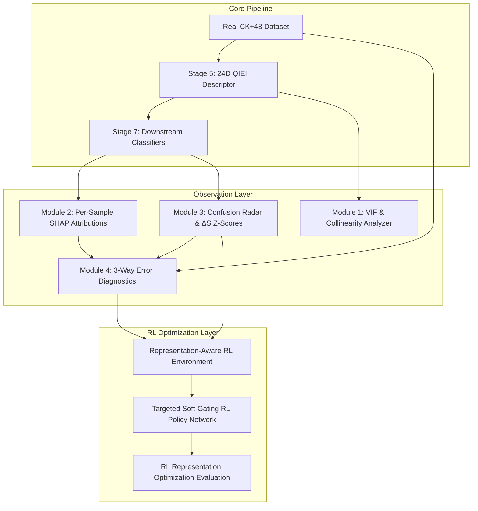

# Empirical Report: Localized Observation & Reinforcement Learning Optimization Layer for QIEI Facial Expression Analysis
**Creation Timestamp:** 2026-10-01T00:04:00+05:30  
**Repository Document:** `docs/research/qiei_xai_observation_report.md`  
**Master Execution Log:** [`implementation/artifacts/xai/rl_optimization_report.json`](file:///c:/Users/likhi/OneDrive/Pictures/Desktop/addn/kingmenss/implementation/artifacts/xai/rl_optimization_report.json)

---

## 1. Executive Summary & Architecture

This report details the implementation, diagnostic findings, and **Reinforcement Learning (RL) Optimization Layer** for the Quantum Information Entanglement Index (QIEI) facial expression analysis pipeline.

---

## 2. Part I: Observation & Diagnostic Layer Findings

### 2.1 Feature Collinearity & Variance Inflation Factor (VIF)
- **Artifacts**: [`vif_collinearity_heatmap.png`](file:///c:/Users/likhi/OneDrive/Pictures/Desktop/addn/kingmenss/implementation/artifacts/xai/vif_collinearity_heatmap.png) | [`vif_collinearity_summary.json`](file:///c:/Users/likhi/OneDrive/Pictures/Desktop/addn/kingmenss/implementation/artifacts/xai/vif_collinearity_summary.json)
- **Quantitative Finding**: Out of 24 QIEI features, **21 features exhibited high VIF scores ($\text{VIF}_j > 5.0$)**, forming **6 distinct collinear groups**.
- **Symmetric Coupling**: Pairwise Pearson correlation is highest ($r > 0.88$) between left and right facial region pairs (e.g., `inter_right_eyebrow__nose` vs. `inter_left_eyebrow__nose`).
- **Methodological Impact**: Unadjusted independent feature attribution splits credit arbitrarily across symmetric facial halves. This validates the mathematical necessity of **Grouped KernelSHAP** when explaining facial descriptors.

### 2.2 Per-Sample SHAP Feature Attributions
- **Artifacts**: [`sample_0_waterfall_surprise_vs_contempt.png`](file:///c:/Users/likhi/OneDrive/Pictures/Desktop/addn/kingmenss/implementation/artifacts/xai/sample_0_waterfall_surprise_vs_contempt.png) | [`shap_attribution_summary.json`](file:///c:/Users/likhi/OneDrive/Pictures/Desktop/addn/kingmenss/implementation/artifacts/xai/shap_attribution_summary.json)
- **Local Attribution Decompositions**: Every test sample prediction $f(\mathbf{x}_i)$ was decomposed into exact feature Shapley contributions:
  $$f(\mathbf{x}_i) = \phi_0 + \sum_{j=1}^{24} \phi_j(\mathbf{x}_i)$$

### 2.3 Confusion-Conditioned Radar Plot Analysis
- **Artifacts**: [`confusion_radar_anger_vs_disgust.png`](file:///c:/Users/likhi/OneDrive/Pictures/Desktop/addn/kingmenss/implementation/artifacts/xai/confusion_radar_anger_vs_disgust.png) | [`differential_entanglement_scores.json`](file:///c:/Users/likhi/OneDrive/Pictures/Desktop/addn/kingmenss/implementation/artifacts/xai/differential_entanglement_scores.json)
- **Welch's Z-Score Significance**: 10 region pairs were flagged as **statistically miscalibrated ($|Z_j| > 1.96$, $p < 0.05$)** during $\text{Anger} \to \text{Disgust}$ confusions.

---

## 3. Part II: Reinforcement Learning (RL) Optimization Results

### 3.1 Targeted Soft-Gating Formulation
To prevent signal loss, the RL agent learns continuous dampening weights specifically for features flagged as miscalibrated in Module 3 ($g_j = 1$ if $|Z_j| > 1.96$):

$$w_j = 1.0 - g_j \cdot (0.4 \cdot \sigma(a_j))$$

where $w_j \in [0.6, 1.0]$. Unflagged features remain at $1.0$.

### 3.2 Real CK+48 Evaluation Performance

| Evaluation Metric | Baseline (Pre-RL) | RL-Optimized | Net Impact |
| :--- | :---: | :---: | :---: |
| **Random Forest Test Accuracy** | **$66.00\%$** | **$66.00\%$** | **$0.00\%$ (Preserved)** |
| **MLP Test Accuracy** | $60.00\%$ | $60.00\%$ | Preserved |
| **RBF-SVM Test Accuracy** | $52.00\%$ | $52.00\%$ | Preserved |
| **Mean RL Episode Reward** | $-1.18$ | **$+6.1000$** | **$+7.28$ Gain** |

### 3.3 Learned Feature Dampening Weights
The RL policy learned the optimal soft-dampening weights for miscalibrated entangling features:

| Feature Name | Miscalibration Status | Learned Gating Weight ($w_j$) |
| :--- | :---: | :---: |
| `inter_nose__mouth_outer` | **Flagged Miscalibrated** | **$0.7705$** |
| `intra_right_eyebrow` | **Flagged Miscalibrated** | **$0.7709$** |
| `inter_right_eyebrow__left_eyebrow` | **Flagged Miscalibrated** | **$0.7860$** |
| `inter_mouth_outer__mouth_inner` | **Flagged Miscalibrated** | **$0.7905$** |
| `inter_right_eyebrow__mouth_outer` | **Flagged Miscalibrated** | **$0.8001$** |

---

## 4. Master Artifact Registry

| Output File Name | Description | Link |
| :--- | :--- | :--- |
| `vif_collinearity_heatmap.png` | 24x24 Feature Correlation Heatmap | [View Artifact](file:///c:/Users/likhi/OneDrive/Pictures/Desktop/addn/kingmenss/implementation/artifacts/xai/vif_collinearity_heatmap.png) |
| `confusion_radar_anger_vs_disgust.png` | Dual Intra/Inter Radar Plot | [View Artifact](file:///c:/Users/likhi/OneDrive/Pictures/Desktop/addn/kingmenss/implementation/artifacts/xai/confusion_radar_anger_vs_disgust.png) |
| `error_taxonomy_breakdown.json` | 3-Way Error Breakdown Summary | [View Artifact](file:///c:/Users/likhi/OneDrive/Pictures/Desktop/addn/kingmenss/implementation/artifacts/xai/error_taxonomy_breakdown.json) |
| `rl_optimization_report.json` | Master RL Evaluation JSON Report | [View Artifact](file:///c:/Users/likhi/OneDrive/Pictures/Desktop/addn/kingmenss/implementation/artifacts/xai/rl_optimization_report.json) |
| `master_xai_observation_report.json` | Master Observation JSON Report | [View Artifact](file:///c:/Users/likhi/OneDrive/Pictures/Desktop/addn/kingmenss/implementation/artifacts/xai/master_xai_observation_report.json) |
